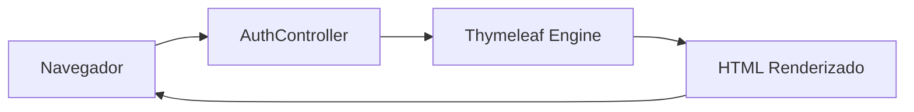
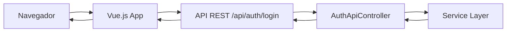

# Guia de Modernização do Frontend - PetDoc

## 📋 Índice

1. [Visão Geral](#visão-geral)
2. [Arquitetura Híbrida](#arquitetura-híbrida)
3. [Implementação Atual - Login Moderno](#implementação-atual---login-moderno)
4. [Próximos Passos](#próximos-passos)
5. [Guia de Migração](#guia-de-migração)
6. [Boas Práticas](#boas-práticas)
7. [Troubleshooting](#troubleshooting)

## 🎯 Visão Geral

Este documento detalha o processo de modernização do frontend do PetDoc, que está migrando de uma arquitetura tradicional **Spring Boot + Thymeleaf** para uma arquitetura **híbrida** que combina:

- **Backend**: Spring Boot 3 com API REST
- **Frontend**: Vue.js 3 para interfaces modernas
- **Compatibilidade**: Manutenção das páginas Thymeleaf existentes

### Objetivo

Modernizar progressivamente o frontend da aplicação mantendo compatibilidade com o sistema existente, permitindo uma transição gradual e controlada.

## 🏗️ Arquitetura Híbrida

### Estrutura Atual

```
petdoc-app/
├── src/main/java/com/petdoc/
│   ├── controller/              # Controllers MVC tradicionais (Thymeleaf)
│   ├── api/
│   │   ├── controller/          # Controllers REST (para Vue.js)
│   │   └── dto/                 # DTOs para API REST
│   ├── service/                 # Lógica de negócio (compartilhada)
│   └── repository/              # Acesso a dados (compartilhado)
│
└── src/main/resources/
    ├── static/
    │   ├── css/
    │   │   ├── login.css        # Estilos para versão Thymeleaf
    │   │   └── login-vue.css    # Estilos para versão Vue.js
    │   └── js/
    │       └── components/      # Componentes Vue.js
    │           └── LoginComponent.js
    └── templates/
        └── auth/
            ├── login.html       # Versão Thymeleaf (clássica)
            └── login-vue.html   # Versão Vue.js (moderna)
```

### Fluxo de Comunicação

#### Versão Thymeleaf (Clássica)


#### Versão Vue.js (Moderna)


## 🚀 Implementação Atual - Login Moderno

### 1. API REST

#### Endpoints Criados

| Endpoint | Método | Descrição |
|----------|--------|-----------|
| `/api/auth/login` | POST | Autentica usuário e cria sessão |
| `/api/auth/status` | GET | Verifica status de autenticação |

#### DTOs Implementados

- **LoginRequestDTO**: Dados de entrada para login
  ```java
  {
    "email": "usuario@email.com",
    "senha": "senha123"
  }
  ```

- **LoginResponseDTO**: Resposta de sucesso
  ```java
  {
    "sucesso": true,
    "mensagem": "Login realizado com sucesso",
    "redirectUrl": "/dashboard",
    "usuario": {
      "nome": "João Silva",
      "email": "joao@email.com"
    }
  }
  ```

- **ErrorResponseDTO**: Resposta de erro
  ```java
  {
    "timestamp": "2025-10-15T04:08:59.009Z",
    "status": 401,
    "erro": "Falha na autenticação",
    "mensagem": "Email ou senha inválidos",
    "path": "/api/auth/login"
  }
  ```

### 2. Componente Vue.js

O componente `LoginComponent.js` implementa:

✅ **Funcionalidades**:
- Validação de formulário em tempo real
- Feedback visual para erros e sucessos
- Carrossel automático de imagens
- Toggle para mostrar/ocultar senha
- Estados de loading durante requisições
- Animações suaves e transições
- Design responsivo

✅ **Características**:
- Componente Vue.js 3 autocontido
- Integração com API REST via Fetch API
- Gerenciamento de estado reativo
- Tratamento robusto de erros

### 3. Configuração de Segurança

O `SecurityConfig.java` foi atualizado para:

- Permitir acesso público aos endpoints da API (`/api/auth/**`)
- Configurar CORS para aceitar requisições do Vue.js
- Definir `/login-vue` como página de login padrão
- Manter compatibilidade com autenticação tradicional

### 4. Estilos Modernos

O `login-vue.css` implementa:

- Design moderno com gradientes e sombras suaves
- Layout responsivo (mobile-first)
- Animações CSS para transições
- Paleta de cores consistente com a identidade visual do PetDoc
- Componentes modulares e reutilizáveis

## 📝 Próximos Passos

### Fase 1: Páginas de Autenticação (✅ Concluído)
- [x] Página de Login

### Fase 2: Páginas de Gestão de Usuário (🔄 Próximo)
- [ ] Página de Cadastro
- [ ] Página de Perfil do Usuário
- [ ] Alteração de Senha

### Fase 3: Dashboard e Navegação
- [ ] Dashboard Principal
- [ ] Menu de Navegação Global
- [ ] Header e Footer Modernos

### Fase 4: Gestão de Pets
- [ ] Listagem de Pets
- [ ] Formulário de Cadastro de Pet
- [ ] Detalhes do Pet
- [ ] Edição de Pet

### Fase 5: Gestão de Vacinas
- [ ] Listagem de Vacinas
- [ ] Formulário de Registro de Vacina
- [ ] Calendário de Vacinação
- [ ] Lembretes

### Fase 6: Otimizações e Melhorias
- [ ] Implementação de estado global (Pinia)
- [ ] Service Workers para offline
- [ ] Progressive Web App (PWA)
- [ ] Otimização de performance
- [ ] Testes automatizados para componentes Vue

## 🔄 Guia de Migração

### Template para Migrar uma Nova Página

#### Passo 1: Criar o Endpoint REST

```java
// src/main/java/com/petdoc/api/controller/NomeDaPaginaApiController.java
@RestController
@RequestMapping("/api/nome-da-pagina")
public class NomeDaPaginaApiController {
    
    @PostMapping
    public ResponseEntity<?> metodoPost(@Valid @RequestBody DadosDTO dados) {
        // Implementar lógica
    }
    
    @GetMapping
    public ResponseEntity<?> metodoGet() {
        // Implementar lógica
    }
}
```

#### Passo 2: Criar DTOs Necessários

```java
// src/main/java/com/petdoc/api/dto/NomeDaPaginaRequestDTO.java
public record NomeDaPaginaRequestDTO(
    @NotBlank String campo1,
    String campo2
) {}

// src/main/java/com/petdoc/api/dto/NomeDaPaginaResponseDTO.java
public record NomeDaPaginaResponseDTO(
    boolean sucesso,
    String mensagem,
    DadosDTO dados
) {}
```

#### Passo 3: Criar Componente Vue.js

```javascript
// src/main/resources/static/js/components/NomeDaPaginaComponent.js
const NomeDaPaginaComponent = {
  name: 'NomeDaPaginaComponent',
  template: `
    <div class="container">
      <!-- Template HTML -->
    </div>
  `,
  data() {
    return {
      // Estado do componente
    };
  },
  methods: {
    async fetchData() {
      const response = await fetch('/api/nome-da-pagina');
      // Processar resposta
    }
  },
  mounted() {
    this.fetchData();
  }
};
```

#### Passo 4: Criar CSS Específico

```css
/* src/main/resources/static/css/nome-da-pagina.css */
.container {
  /* Estilos específicos */
}
```

#### Passo 5: Criar Template HTML

```html
<!-- src/main/resources/templates/nome-da-pagina-vue.html -->
<!DOCTYPE html>
<html lang="pt-br">
<head>
    <meta charset="UTF-8">
    <title>Nome da Página - PetDoc</title>
    <link rel="stylesheet" href="/css/nome-da-pagina.css">
    <script src="https://unpkg.com/vue@3.5.13/dist/vue.global.prod.js"></script>
</head>
<body>
    <div id="app">
        <nome-da-pagina-component></nome-da-pagina-component>
    </div>
    <script src="/js/components/NomeDaPaginaComponent.js"></script>
    <script>
        const { createApp } = Vue;
        createApp({
            components: {
                'nome-da-pagina-component': NomeDaPaginaComponent
            }
        }).mount('#app');
    </script>
</body>
</html>
```

#### Passo 6: Adicionar Rota no Controller

```java
@GetMapping("/nome-da-pagina-vue")
public String exibirPaginaVue() {
    return "nome-da-pagina-vue";
}
```

#### Passo 7: Atualizar SecurityConfig

```java
.authorizeHttpRequests(authorize -> authorize
    .requestMatchers("/api/nome-da-pagina/**").permitAll()
    // ... outras configurações
)
```

## 💡 Boas Práticas

### 1. Estrutura de Componentes Vue

- **Um componente por arquivo**: Mantenha cada componente em seu próprio arquivo
- **Nomenclatura clara**: Use PascalCase para nomes de componentes
- **Componentes reutilizáveis**: Extraia lógica comum em componentes compartilhados

### 2. Comunicação com API

- **Use async/await**: Para código mais legível
- **Tratamento de erros**: Sempre implemente try/catch
- **Loading states**: Mostre feedback visual durante requisições
- **Validação**: Valide dados no frontend E backend

### 3. Gerenciamento de Estado

Para páginas complexas, considere:
- **Props e Events**: Para comunicação entre componentes
- **Provide/Inject**: Para dados globais simples
- **Pinia**: Para gerenciamento de estado complexo (futuro)

### 4. Estilização

- **CSS modular**: Mantenha estilos específicos por componente
- **Variáveis CSS**: Use para cores e espaçamentos consistentes
- **Mobile-first**: Design responsivo desde o início
- **Transições suaves**: Use animações CSS para melhor UX

### 5. Segurança

- **Validação**: Sempre valide dados no backend
- **CSRF**: Configure adequadamente para produção
- **Sanitização**: Nunca confie em dados do cliente
- **CORS**: Configure apenas origens confiáveis

### 6. Performance

- **Lazy loading**: Carregue componentes sob demanda
- **Debounce**: Para inputs com busca/filtro
- **Cache**: Use headers HTTP apropriados
- **Minificação**: Para produção, use builds minificados

## 🔧 Troubleshooting

### Problema: Erro 403 ao fazer login

**Solução**: Verifique se CSRF está configurado corretamente no SecurityConfig:
```java
.csrf(csrf -> csrf.disable()) // Para desenvolvimento
```

### Problema: CORS bloqueando requisições

**Solução**: Verifique a configuração do CORS no SecurityConfig:
```java
configuration.setAllowedOrigins(Arrays.asList("http://localhost:8080"));
configuration.setAllowCredentials(true);
```

### Problema: Sessão não é mantida após login

**Solução**: Certifique-se de usar `credentials: 'include'` no fetch:
```javascript
fetch('/api/auth/login', {
  credentials: 'include',
  // ...
});
```

### Problema: Vue não está renderizando

**Solução**: Verifique se:
1. Vue.js está carregado antes dos componentes
2. O componente está registrado corretamente
3. O elemento `#app` existe no DOM

### Problema: Estilos não são aplicados

**Solução**: Verifique:
1. Caminho correto do arquivo CSS
2. Se o Spring Boot está servindo recursos estáticos
3. Cache do navegador (Ctrl+F5 para limpar)

## 📚 Recursos Adicionais

### Documentação

- [Vue.js 3 Documentation](https://vuejs.org/)
- [Spring Boot REST API](https://spring.io/guides/gs/rest-service/)
- [Spring Security](https://spring.io/projects/spring-security)

### Ferramentas Recomendadas

- **Vue DevTools**: Extensão do navegador para debug
- **Postman**: Para testar endpoints da API
- **VS Code**: Editor recomendado com extensões Vue

### Padrões de Código

- Seguir convenções do Vue.js Style Guide
- Manter consistência com código Java existente
- Documentar componentes e APIs complexas

---

## 📞 Suporte

Para dúvidas ou problemas durante a migração, consulte:
1. Este documento
2. Código de exemplo na página de login
3. Documentação oficial das tecnologias

**Última atualização**: 2025-10-15
