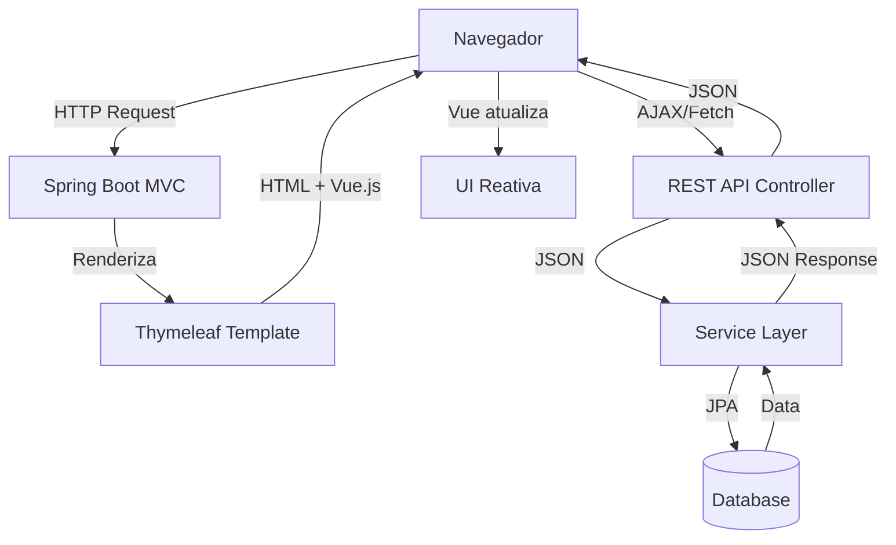

# PetDoc - Documentação da Interface Moderna

## 📋 Visão Geral

A interface moderna do PetDoc foi desenvolvida usando **Vue.js 3** integrado com **Spring Boot** e **Thymeleaf**, criando uma experiência de usuário mais interativa e moderna, mantendo a arquitetura backend original.

## 🎨 Design System

### Paleta de Cores

A paleta de cores foi preservada do design original:

```css
--color-primary: #006A71         /* Verde escuro principal */
--color-primary-light: #008891   /* Verde médio para gradientes */
--color-primary-dark: #00565c    /* Verde mais escuro para hover */
--color-pastel-green: #e0ffed    /* Verde pastel (fundo suave) */
--color-white: #ffffff           /* Branco */
```

### Componentes Principais

#### 1. **Cards Modernos**
- Bordas arredondadas (`border-radius: 0.75rem - 1rem`)
- Sombras suaves com efeito de profundidade
- Animações de hover (elevação e mudança de borda)
- Gradientes sutis nos cabeçalhos

#### 2. **Botões**
- Gradientes lineares para botões primários
- Efeitos de elevação no hover
- Estados de loading integrados
- Bordas arredondadas consistentes

#### 3. **Inputs**
- Bordas de 2px para melhor visibilidade
- Efeito de focus com borda colorida e sombra
- Transições suaves
- Placeholders estilizados

#### 4. **Animações e Transições**

```css
/* Fade In/Out */
.fade-enter-active, .fade-leave-active {
    transition: opacity 250ms ease-in-out;
}

/* Slide Fade */
.slide-fade-enter-active {
    transition: all 350ms ease-in-out;
}

/* List Transitions */
.list-enter-active, .list-leave-active {
    transition: all 250ms ease-in-out;
}
```

## 🚀 Arquitetura da Nova Interface

### Abordagem Híbrida

A aplicação agora utiliza uma **arquitetura híbrida**:

1. **Backend (Spring Boot)**: Mantido intacto
   - Controllers MVC tradicionais para renderização de páginas
   - REST API Controllers para operações CRUD
   - Serviços e Repositórios inalterados

2. **Frontend (Vue.js + Thymeleaf)**:
   - Thymeleaf renderiza a estrutura inicial da página
   - Vue.js gerencia a interatividade e chamadas AJAX
   - Progressive Enhancement: funciona sem JS, melhor com JS

### Fluxo de Dados



## 📁 Estrutura de Arquivos

```
src/main/
├── java/com/petdoc/
│   ├── controller/
│   │   ├── AuthController.java          # Login/Cadastro
│   │   ├── DashboardController.java     # Dashboard
│   │   └── api/
│   │       └── PetRestController.java   # REST API para Pets
│   ├── service/                         # Inalterados
│   └── repository/                      # Inalterados
├── resources/
│   ├── static/
│   │   ├── css/
│   │   │   ├── modern.css              # Design system moderno
│   │   │   ├── login.css               # Estilos de login (preservado)
│   │   │   ├── style.css               # Estilos globais antigos
│   │   │   └── custom.css              # Customizações
│   │   └── js/
│   │       └── dashboard.js            # Vue.js app do dashboard
│   └── templates/
│       ├── auth/
│       │   ├── login-modern.html       # Login moderno (novo)
│       │   ├── login.html              # Login legado (preservado)
│       │   ├── cadastro-modern.html    # Cadastro moderno (novo)
│       │   └── cadastro.html           # Cadastro legado (preservado)
│       ├── dashboard-modern.html       # Dashboard moderno (novo)
│       └── dashboard.html              # Dashboard legado (preservado)
```

## 🔌 API REST Endpoints

### Pets API (`/api/pets`)

#### GET `/api/pets`
Lista todos os pets do tutor autenticado.

**Response:**
```json
[
  {
    "id": 1,
    "nome": "Rex",
    "especie": "Cachorro",
    "raca": "Golden Retriever",
    "dataNascimento": "2020-03-15"
  }
]
```

#### GET `/api/pets/{id}`
Busca um pet específico por ID.

**Response:**
```json
{
  "id": 1,
  "nome": "Rex",
  "especie": "Cachorro",
  "raca": "Golden Retriever",
  "dataNascimento": "2020-03-15"
}
```

#### POST `/api/pets`
Cria um novo pet.

**Request Body:**
```json
{
  "nome": "Rex",
  "especie": "Cachorro",
  "raca": "Golden Retriever",
  "dataNascimento": "2020-03-15"
}
```

**Response:**
```json
{
  "success": true,
  "message": "Pet cadastrado com sucesso!"
}
```

#### PUT `/api/pets/{id}`
Atualiza um pet existente.

**Request Body:** (mesma estrutura do POST)

**Response:**
```json
{
  "success": true,
  "message": "Pet atualizado com sucesso!"
}
```

#### DELETE `/api/pets/{id}`
Exclui um pet.

**Response:**
```json
{
  "success": true,
  "message": "Pet excluído com sucesso!"
}
```

## 💻 Componentes Vue.js

### Dashboard App (`dashboard.js`)

#### Data Properties
- `pets`: Array de pets
- `filteredPets`: Pets filtrados pela busca
- `loading`: Estado de carregamento
- `searchQuery`: Texto de busca
- `speciesFilter`: Filtro por espécie
- `showAddModal`: Controle do modal
- `petForm`: Dados do formulário
- `toast`: Notificações

#### Computed Properties
- `speciesList`: Lista única de espécies
- `hasPets`: Verifica se há pets cadastrados

#### Methods
- `loadPets()`: Carrega pets via API
- `filterPets()`: Filtra pets por busca e espécie
- `savePet()`: Salva/atualiza pet via API
- `deletePet()`: Exclui pet via API
- `calculateAge()`: Calcula idade do pet
- `showToast()`: Exibe notificação

### Login App (`login-modern.html`)

#### Features
- Toggle de visibilidade de senha
- Estados de loading
- Validação em tempo real
- Animações suaves

### Cadastro App (`cadastro-modern.html`)

#### Features
- Medidor de força de senha
- Verificação de correspondência de senhas
- Validação de e-mail
- Toggle de visibilidade de senha
- Mensagens de erro em tempo real

## 🎯 Funcionalidades Implementadas

### ✅ Dashboard Moderno
- [x] Cards de KPI animados
- [x] Busca em tempo real
- [x] Filtro por espécie
- [x] Modal interativo para CRUD de pets
- [x] Cards de pets com animações
- [x] Estados de loading (skeleton screens)
- [x] Notificações toast
- [x] Empty state quando não há pets
- [x] Transições suaves entre estados

### ✅ Login Moderno
- [x] Carrossel de imagens preservado
- [x] Toggle de visibilidade de senha
- [x] Estado de loading no botão
- [x] Animações de entrada
- [x] Gradientes no fundo
- [x] Design responsivo

### ✅ Cadastro Moderno
- [x] Validação de e-mail em tempo real
- [x] Medidor de força de senha
- [x] Verificação de correspondência de senhas
- [x] Toggle de visibilidade de senhas
- [x] Feedback visual de validação
- [x] Animações suaves

## 🔧 Como Usar

### Para Desenvolvedores

#### 1. Acessar Interface Moderna
```
http://localhost:8080/login          # Login moderno
http://localhost:8080/cadastro       # Cadastro moderno
http://localhost:8080/dashboard      # Dashboard moderno
```

#### 2. Acessar Interface Legada (para comparação)
```
http://localhost:8080/login/legacy     # Login legado
http://localhost:8080/cadastro/legacy  # Cadastro legado
http://localhost:8080/dashboard/legacy # Dashboard legado
```

#### 3. Testar API REST
```bash
# Listar pets (requer autenticação)
curl -X GET http://localhost:8080/api/pets \
  -H "Cookie: JSESSIONID=..."

# Criar pet
curl -X POST http://localhost:8080/api/pets \
  -H "Content-Type: application/json" \
  -H "Cookie: JSESSIONID=..." \
  -d '{
    "nome": "Rex",
    "especie": "Cachorro",
    "raca": "Golden Retriever",
    "dataNascimento": "2020-03-15"
  }'
```

## 🎨 Customização

### Alterar Cores

Edite o arquivo `/src/main/resources/static/css/modern.css`:

```css
:root {
    --color-primary: #006A71;        /* Sua cor primária */
    --color-primary-light: #008891;  /* Tom mais claro */
    --color-pastel-green: #e0ffed;   /* Fundo suave */
}
```

### Adicionar Novos Componentes Vue

1. Crie um novo arquivo JS em `/static/js/`
2. Defina o componente Vue.js
3. Importe no template Thymeleaf
4. Monte o app Vue no elemento desejado

Exemplo:
```html
<script th:src="@{/js/meu-componente.js}"></script>
<div id="meu-app"></div>
```

## 📊 Comparação: Antes vs Depois

| Aspecto | Interface Legada | Interface Moderna |
|---------|------------------|-------------------|
| Framework Frontend | HTML puro + Bootstrap | Vue.js 3 + Bootstrap |
| Interatividade | Baixa (recarrega página) | Alta (SPA-like) |
| Animações | Nenhuma | Transições suaves |
| API REST | Não | Sim |
| Loading States | Não | Sim (skeleton screens) |
| Notificações | Alerts simples | Toast modernas |
| Validação | Server-side apenas | Real-time + Server-side |
| UX | Básica | Moderna e fluida |

## 🚀 Próximos Passos

### Funcionalidades Planejadas
- [ ] API REST para Vacinas
- [ ] Página de perfil do Pet
- [ ] Histórico de vacinas interativo
- [ ] Calendário de lembretes
- [ ] Upload de fotos de pets
- [ ] Gráficos e estatísticas
- [ ] Notificações push
- [ ] Dark mode

### Melhorias Técnicas
- [ ] Testes unitários para componentes Vue
- [ ] Service Workers para modo offline
- [ ] Lazy loading de componentes
- [ ] Otimização de performance
- [ ] Acessibilidade (WCAG 2.1)
- [ ] Internacionalização (i18n)

## 📝 Notas de Desenvolvimento

### Decisões Técnicas

1. **Por que Vue.js via CDN?**
   - Integração simples com Thymeleaf
   - Sem necessidade de build step
   - Progressive Enhancement
   - Fácil manutenção

2. **Por que manter Thymeleaf?**
   - Backend rendering para SEO
   - Segurança (autenticação no servidor)
   - Compatibilidade com Spring Security
   - Fallback quando JS está desabilitado

3. **Por que REST API + MVC?**
   - Flexibilidade (pode adicionar mobile app futuramente)
   - Separação de concerns
   - Melhor testabilidade
   - Reusabilidade de código

### Boas Práticas

- ✅ Mantenha a paleta de cores consistente
- ✅ Use variáveis CSS para temas
- ✅ Implemente estados de loading
- ✅ Forneça feedback visual para ações
- ✅ Valide no cliente E no servidor
- ✅ Mantenha acessibilidade (ARIA labels)
- ✅ Teste em diferentes navegadores
- ✅ Otimize imagens e assets

## 🐛 Troubleshooting

### Problema: Componentes Vue não carregam
**Solução:** Verifique se o script do Vue.js CDN está carregando antes do seu app script.

### Problema: API retorna 401 (Não autorizado)
**Solução:** Certifique-se de estar autenticado. Spring Security gerencia sessões via cookies.

### Problema: CSRF Token missing
**Solução:** CSRF está desabilitado para API endpoints. Caso habilite, inclua token nos headers.

### Problema: Estilos não aplicam
**Solução:** Limpe o cache do navegador ou faça hard refresh (Ctrl + Shift + R).

## 📚 Recursos e Referências

- [Vue.js 3 Documentation](https://vuejs.org/)
- [Spring Boot Documentation](https://spring.io/projects/spring-boot)
- [Thymeleaf Documentation](https://www.thymeleaf.org/)
- [Bootstrap 5 Documentation](https://getbootstrap.com/)
- [Font Awesome Icons](https://fontawesome.com/)

---

**Desenvolvido com ❤️ para o PetDoc**
