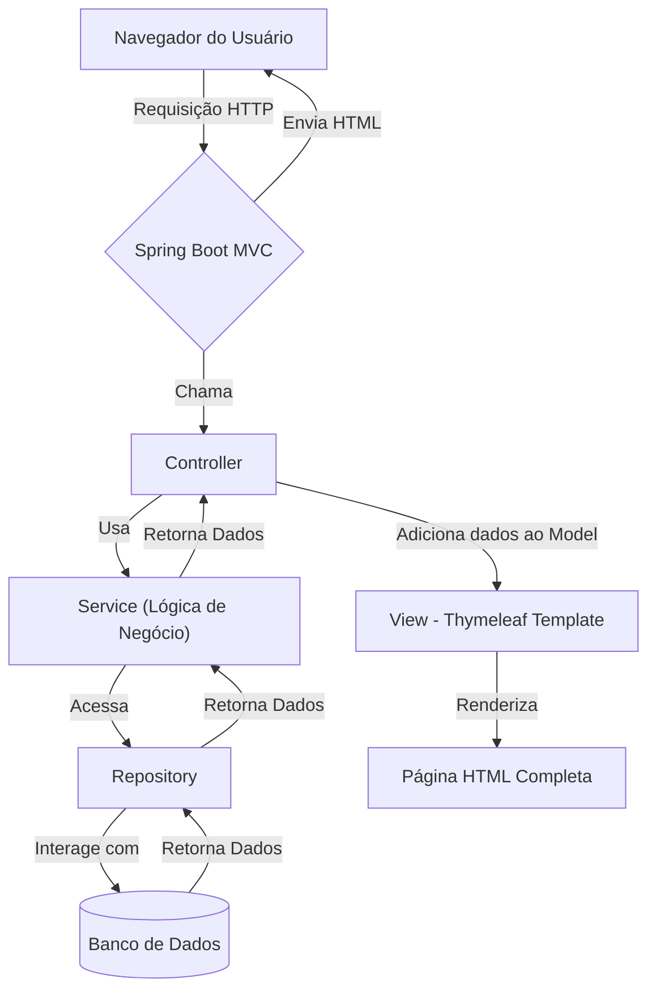
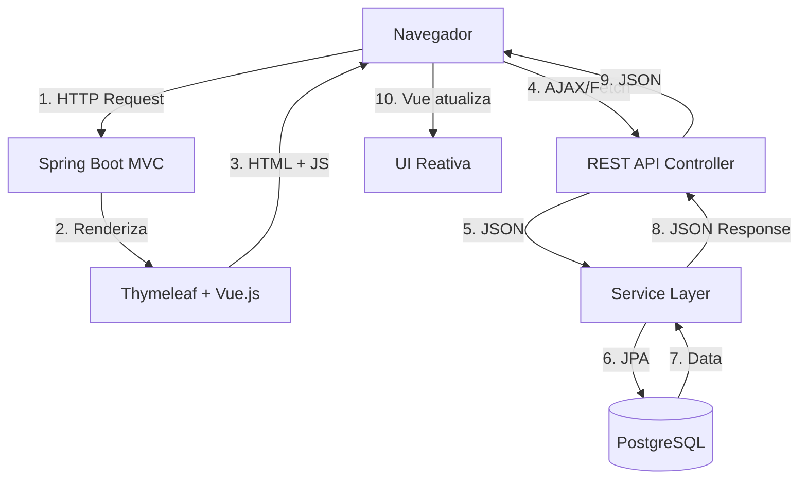

# Pet Doc - Sua Carteira de Vacinação PET

[](https://github.com/bmatox/petdoc-app)

O Pet Doc é uma plataforma digital para centralizar e gerenciar o histórico de vacinação de animais de estimação, substituindo a caderneta de papel e automatizando lembretes de doses futuras.

## ✨ Funcionalidades (MVP)

-   [ ] **Cadastro de Tutores e Pets:** Gerenciamento centralizado das informações dos animais.
-   [ ] **Carteira de Vacinação Digital:** Registro completo do histórico de vacinas.
-   [ ] **Lembretes Automáticos:** Notificações por e-mail sobre as próximas doses.
-   [ ] **Autenticação Segura:** Acesso protegido por login e senha com controle de sessão.

## 🏛️ Arquitetura do Projeto

A aplicação utiliza uma **Arquitetura Híbrida** combinando:
- **Server-Side Rendering (SSR)** com Thymeleaf para páginas iniciais
- **Client-Side Interactivity** com Vue.js 3 para experiência moderna
- **REST API** para comunicação assíncrona

### Arquitetura Tradicional (SSR)

O Spring Boot renderiza páginas HTML completas usando Thymeleaf:



### Arquitetura Moderna (Híbrida)

Páginas são renderizadas no servidor, mas Vue.js adiciona interatividade:



### Camadas da Aplicação

A aplicação é organizada em uma **Arquitetura em Camadas** para garantir a separação de responsabilidades:

-   **`Controller` (Camada de Apresentação):** 
    - **MVC Controllers**: Recebem requisições HTTP, interagem com a camada de serviço e retornam Views (Thymeleaf)
    - **REST API Controllers**: Retornam dados em JSON para consumo do frontend Vue.js
-   **`Service` (Camada de Negócio):** Orquestra a lógica de negócio da aplicação, validando regras e garantindo a integridade dos processos.
-   **`Repository` (Camada de Acesso a Dados):** Interface responsável pela comunicação com o banco de dados, utilizando o Spring Data JPA.
-   **`Model` (Camada de Domínio):** Contém as entidades JPA (`@Entity`) que mapeiam o modelo de dados relacional.

### Interface Moderna

A interface foi modernizada usando **Vue.js 3** integrado com Thymeleaf:

-   ✨ **Interatividade**: Busca em tempo real, filtros dinâmicos, modals interativos
-   🎨 **Design Moderno**: Cards animados, transições suaves, gradientes
-   🚀 **Performance**: Loading states, skeleton screens, feedback instantâneo
-   📱 **Responsivo**: Funciona perfeitamente em desktop, tablet e mobile

**Documentação Completa:** Veja [MODERN_UI_DOCS.md](MODERN_UI_DOCS.md) para detalhes sobre a interface moderna.

## 🛠️ Tecnologias Utilizadas

| Ferramenta | Versão/Tecnologia | Descrição |
| ------------------- | ----------------- | -------------------------------------------------- |
| **Linguagem** | Java | Versão 21+ |
| **Framework** | Spring Boot 3 | Framework para desenvolvimento da aplicação web |
| **View Layer** | Thymeleaf 3+ & Vue.js 3 | Template Engine (SSR) + Framework Reativo (CSR) |
| **Banco de Dados** | PostgreSQL | Gerenciado via **Docker** e com migrações **Flyway** |
| **Gerenciador** | Maven | Gerenciador de dependências e build do projeto |
| **Autenticação** | Spring Security | Autenticação e autorização baseada em Sessão |

## 🚀 Como Executar o Projeto

Este guia irá te ajudar a configurar e executar o ambiente de desenvolvimento localmente. Após a configuração inicial, a aplicação pode ser iniciada com um único comando.

### Pré-requisitos

Antes de começar, garanta que você tenha as seguintes ferramentas instaladas em sua máquina:

-   **Java JDK 21+** ([Download](https://www.oracle.com/java/technologies/downloads/))
-   **Docker** e **Docker Compose** ([Download Docker Desktop](https://www.docker.com/products/docker-desktop/))

O Maven será gerenciado pelo wrapper (`mvnw`) incluído no projeto.

### 1. Configuração Inicial (Apenas na primeira vez)

Estes passos são necessários apenas na primeira vez que você configurar o projeto.

```bash
# 1. Clone o repositório para sua máquina local
git clone [https://github.com/bmatox/petdoc-app.git](https://github.com/bmatox/petdoc-app.git)

# 2. Navegue para a pasta do projeto
cd petdoc-app
```

**Configuração do Banco de Dados:**

A aplicação precisa de um arquivo `application.properties` com as credenciais do banco.

1.  Navegue até a pasta `backend/src/main/resources/`.
2.  Crie uma cópia do arquivo `application.properties.example` (se ele existir) e renomeie a cópia para `application.properties`.
3.  Garanta que as credenciais no `application.properties` batem com as definidas no arquivo `.env` ou `docker-compose.yml`.

### 2. Executando com o Script Automatizado

Com a configuração inicial feita, para iniciar todo o ambiente (banco de dados + aplicação), basta executar o script correspondente ao seu sistema operacional a partir da **raiz do projeto**.

-   **No Windows:**
    ```bash
    .\iniciar.bat
    ```

-   **No Linux ou macOS:**
    ```bash
    # Dê permissão de execução ao script (apenas na primeira vez)
    chmod +x iniciar.sh

    # Execute o script
    ./iniciar.sh
    ```


O script irá automaticamente verificar suas dependências, iniciar o container do banco de dados e rodar a aplicação Spring Boot. A aplicação web estará acessível em **`http://localhost:8080`**.

## 🎨 Interface Moderna

A aplicação agora possui uma **interface moderna e interativa** desenvolvida com Vue.js 3:

### Principais Recursos

-   ✨ **Dashboard Interativo**: Busca em tempo real, filtros dinâmicos, animações suaves
-   🎯 **CRUD Completo de Pets**: Modal interativo para adicionar/editar pets sem recarregar a página
-   📊 **KPI Cards Animados**: Cards com métricas importantes e efeitos hover
-   🔔 **Notificações Toast**: Feedback visual para ações do usuário
-   🎭 **Estados de Loading**: Skeleton screens enquanto carrega dados
-   🎨 **Design System Moderno**: Paleta de cores verde pastel, branco e verde escuro preservada
-   📱 **Totalmente Responsivo**: Funciona perfeitamente em desktop, tablet e mobile

### Acessar a Interface

```
http://localhost:8080/login       # Login moderno com carrossel de imagens
http://localhost:8080/cadastro    # Cadastro com validação em tempo real
http://localhost:8080/dashboard   # Dashboard interativo com Vue.js
```

### Interface Legada (para comparação)

As versões antigas foram preservadas:
```
http://localhost:8080/login/legacy
http://localhost:8080/cadastro/legacy
http://localhost:8080/dashboard/legacy
```

📖 **Documentação Completa**: Consulte [MODERN_UI_DOCS.md](MODERN_UI_DOCS.md) para detalhes técnicos, API REST endpoints e guia de customização.

## 🔌 REST API

A aplicação expõe uma REST API para operações CRUD:

### Pets API

```bash
# Listar todos os pets
GET /api/pets

# Buscar pet por ID
GET /api/pets/{id}

# Criar novo pet
POST /api/pets
Content-Type: application/json
{
  "nome": "Rex",
  "especie": "Cachorro",
  "raca": "Golden Retriever",
  "dataNascimento": "2020-03-15"
}

# Atualizar pet
PUT /api/pets/{id}

# Deletar pet
DELETE /api/pets/{id}
```

💡 **Nota**: Todas as requisições à API requerem autenticação via sessão (Spring Security).

