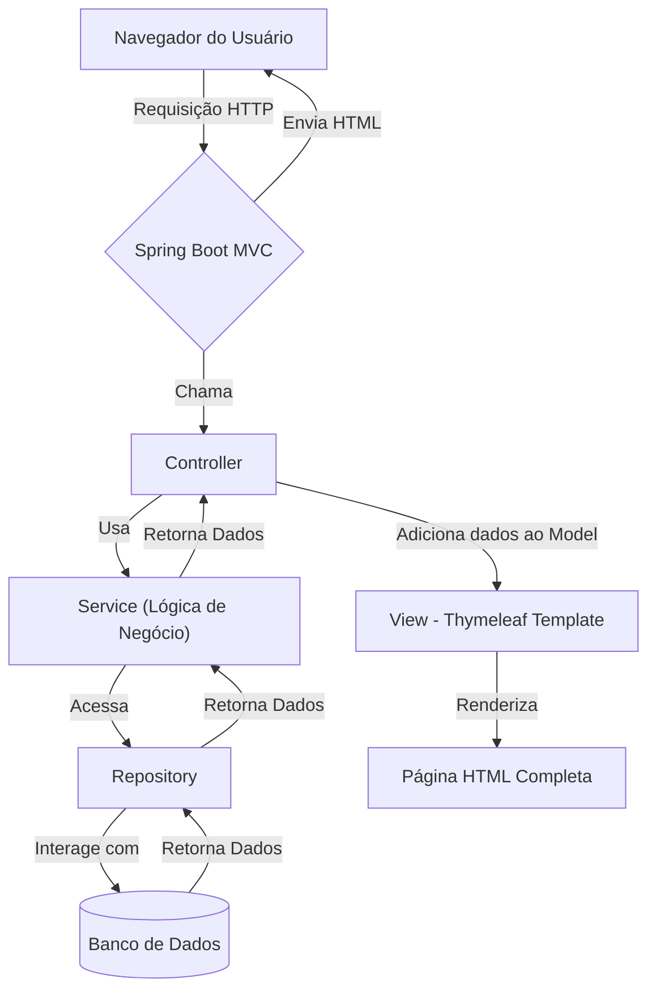

# Pet Doc - Sistema de Gestão de Vacinação Animal

[](https://github.com/bmatox/petdoc-app)

O Pet Doc é uma plataforma digital para centralizar e gerenciar o histórico de vacinação de animais de estimação, substituindo a caderneta de papel e automatizando lembretes de doses futuras.

## ✨ Funcionalidades (MVP)

-   [ ] **Cadastro de Tutores e Pets:** Gerenciamento centralizado das informações dos animais.
-   [ ] **Carteira de Vacinação Digital:** Registro completo do histórico de vacinas.
-   [ ] **Lembretes Automáticos:** Notificações por e-mail sobre as próximas doses.
-   [ ] **Autenticação Segura:** Acesso protegido por login e senha com controle de sessão.

## 🏛️ Arquitetura do Projeto

A aplicação é construída sobre uma **Arquitetura Monolítica com Renderização no Servidor (Server-Side Rendering)**, utilizando o padrão **MVC (Model-View-Controller)**.

O Spring Boot é responsável por todo o fluxo: ele recebe a requisição do navegador, processa a lógica de negócio, acessa o banco de dados e, por fim, utiliza o Thymeleaf como *template engine* para gerar e enviar uma página HTML completa de volta para o usuário.



### Camadas da Aplicação

A aplicação é organizada em uma **Arquitetura em Camadas** para garantir a separação de responsabilidades:

-   **`Controller` (Camada de Apresentação):** Recebe as requisições HTTP do navegador, interage com a camada de serviço e retorna o nome da View (template Thymeleaf) a ser renderizada.
-   **`Service` (Camada de Negócio):** Orquestra a lógica de negócio da aplicação, validando regras e garantindo a integridade dos processos.
-   **`Repository` (Camada de Acesso a Dados):** Interface responsável pela comunicação com o banco de dados, utilizando o Spring Data JPA.
-   **`Model` (Camada de Domínio):** Contém as entidades JPA (`@Entity`) que mapeiam o modelo de dados relacional.

## 🛠️ Tecnologias Utilizadas

| Ferramenta | Versão/Tecnologia | Descrição |
| ------------------- | ----------------- | -------------------------------------------------- |
| **Linguagem** | Java | Versão 21+ |
| **Framework** | Spring Boot 3 | Framework para desenvolvimento da aplicação web |
| **View Layer** | Thymeleaf 3+ | Template Engine para renderização no servidor (SSR) |
| **Banco de Dados** | PostgreSQL | Gerenciado via **Docker** e com migrações **Flyway** |
| **Gerenciador** | Maven | Gerenciador de dependências e build do projeto |
| **Autenticação** | Spring Security | Autenticação e autorização baseada em Sessão |

## 🚀 Como Executar o Projeto

Este guia irá te ajudar a configurar e executar o ambiente de desenvolvimento localmente.

### Pré-requisitos

Antes de começar, garanta que você tenha as seguintes ferramentas instaladas em sua máquina:

-   **Java JDK 21+** ([Download](https://www.oracle.com/java/technologies/downloads/))
-   **Maven 3.8+** ([Download](https://maven.apache.org/download.cgi))
-   **Docker** e **Docker Compose** ([Download Docker Desktop](https://www.docker.com/products/docker-desktop/))
-   Uma IDE de sua preferência (ex: IntelliJ IDEA, Eclipse).

### 1. Configuração Inicial

Primeiro, clone o repositório e configure a conexão com o banco de dados.

```bash
# 1. Clone o repositório para sua máquina local
git clone [https://github.com/bmatox/petdoc-app.git](https://github.com/bmatox/petdoc-app.git)

# 2. Navegue para a pasta do projeto
cd petdoc-app
```

**Configuração do Banco de Dados:**

1.  Navegue até `backend/src/main/resources/`.
2.  Crie uma cópia do arquivo `application.properties.example` e renomeie-a para `application.properties`.
3.  Abra o novo arquivo `application.properties` e preencha a senha do banco de dados.
    * **Importante:** A senha deve ser a mesma que você definiu no arquivo `docker-compose.yml` (ex: `sua_senha_segura`).

### 2. Executando a Aplicação

Siga os passos na ordem para iniciar os serviços.

**Passo 1: Iniciar o Banco de Dados com Docker**

Com o Docker Desktop em execução, rode o seguinte comando na **raiz do projeto**:

```bash
# Este comando vai iniciar o container do PostgreSQL em segundo plano
docker-compose up -d
```
Seu banco de dados estará rodando e pronto para aceitar conexões na porta `5432`.

**Passo 2: Iniciar a Aplicação Web**

Navegue até a pasta do backend para iniciar a aplicação Spring Boot.

```bash
# Navegue até a pasta do backend
cd backend

# Compile e execute o projeto
./mvnw spring-boot:run
```
A aplicação web completa estará acessível no seu navegador em **`http://localhost:8080`**.