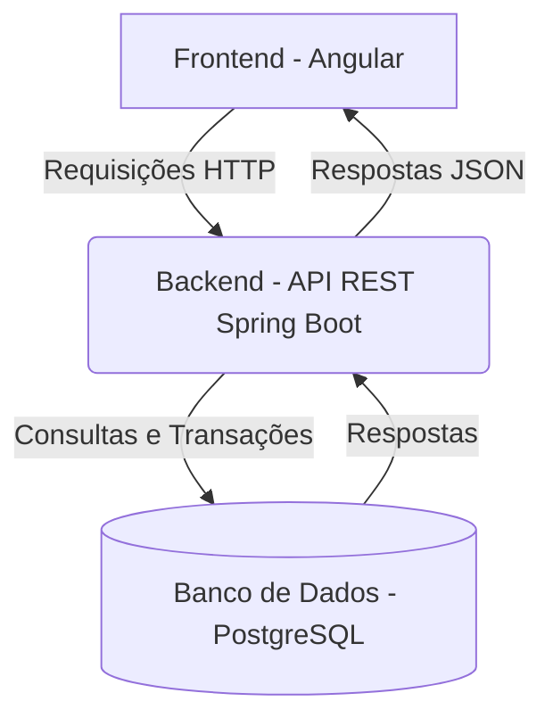

# Pet Doc - Sistema de Gestão de Vacinação Animal

O Pet Doc é uma plataforma digital para centralizar e gerenciar o histórico de vacinação de animais de estimação, substituindo a caderneta de papel e automatizando lembretes de doses futuras.

## ✨ Funcionalidades (MVP)

-   [ ] **Cadastro de Tutores e Pets:** Gerenciamento centralizado das informações dos animais.
-   [ ] **Carteira de Vacinação Digital:** Registro completo do histórico de vacinas.
-   [ ] **Lembretes Automáticos:** Notificações por e-mail sobre as próximas doses.
-   [ ] **Autenticação Segura:** Acesso protegido por login e senha com JWT.

## 🏛️ Arquitetura do Projeto

A aplicação é construída sobre uma **Arquitetura Cliente-Servidor desacoplada**, utilizando uma API RESTful no backend para se comunicar com um frontend Single-Page Application (SPA).

### Backend (Spring Boot)

O backend segue os princípios do padrão **MVC (Model-View-Controller)** e é organizado em uma **Arquitetura em Camadas** para garantir a separação de responsabilidades e a manutenibilidade do código.

-   **`Controller` (Camada de API):** Responsável por expor os endpoints REST. Recebe as requisições, valida os dados de entrada (DTOs) e delega a chamada para a camada de serviço.
-   **`Service` (Camada de Negócio):** Orquestra a lógica de negócio da aplicação. É aqui que as regras e validações principais residem, garantindo a integridade dos processos.
-   **`Repository` (Camada de Acesso a Dados):** Interface responsável pela comunicação com o banco de dados, abstraindo as consultas através do Spring Data JPA.
-   **`Model` (Camada de Domínio):** Contém as entidades JPA que mapeiam o modelo de dados relacional.

## 🛠️ Tecnologias Utilizadas

| Ferramenta | Versão/Tecnologia | Descrição |
| ------------------- | ----------------- | -------------------------------------------------- |
| **Linguagem** | Java | Versão 21+ |
| **Backend** | Spring Boot 3 | Framework para criação da API REST |
| **Frontend** | Angular 16+ | Framework para construção da interface do usuário |
| **Banco de Dados** | PostgreSQL | Sistema de Gerenciamento de Banco de Dados Relacional |
| **Gerenciador** | Maven | Gerenciador de dependências e build do projeto Java |
| **Autenticação** | Spring Security / JWT | Framework de segurança e padrão de tokens |

## 🚀 Como Executar o Projeto

### Pré-requisitos

-   Java JDK 21 ou superior
-   Maven 3.8+
-   Node.js 18+
-   Uma instância do PostgreSQL rodando localmente

###