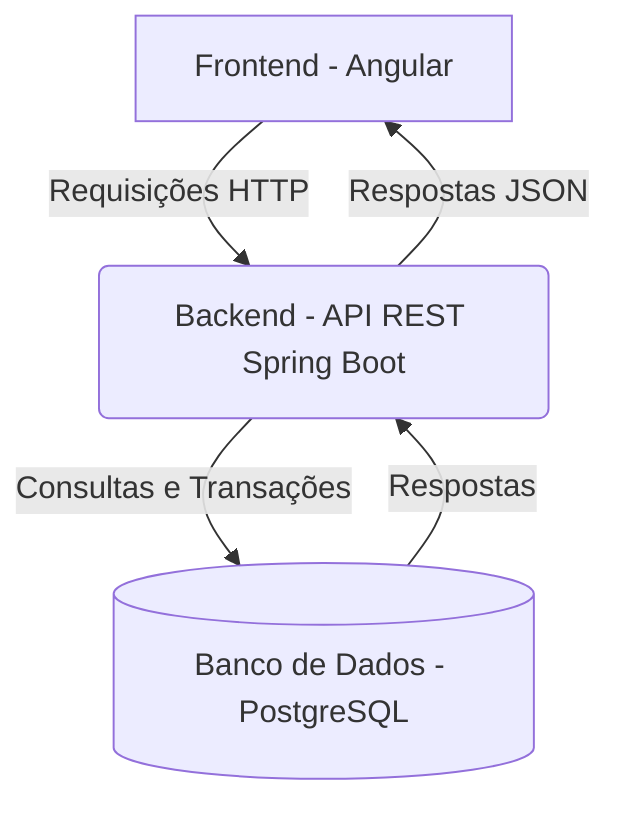

# Pet Doc - Sistema de Gestão de Vacinação Animal

[](https://github.com/bmatox/petdoc-app)

O Pet Doc é uma plataforma digital para centralizar e gerenciar o histórico de vacinação de animais de estimação, substituindo a caderneta de papel e automatizando lembretes de doses futuras.

## ✨ Funcionalidades (MVP)

-   [ ] **Cadastro de Tutores e Pets:** Gerenciamento centralizado das informações dos animais.
-   [ ] **Carteira de Vacinação Digital:** Registro completo do histórico de vacinas.
-   [ ] **Lembretes Automáticos:** Notificações por e-mail sobre as próximas doses.
-   [ ] **Autenticação Segura:** Acesso protegido por login e senha com JWT.

## 🏛️ Arquitetura do Projeto

A aplicação é construída sobre uma **Arquitetura Cliente-Servidor desacoplada**, utilizando uma API RESTful no backend para se comunicar com um frontend Single-Page Application (SPA).



### Backend (Spring Boot)

O backend segue os princípios do padrão **MVC (Model-View-Controller)** e é organizado em uma **Arquitetura em Camadas** para garantir a separação de responsabilidades e a manutenibilidade do código.

-   **`Controller` (Camada de API):** Responsável por expor os endpoints REST. Recebe as requisições, valida os dados de entrada (DTOs) e delega a chamada para a camada de serviço.
-   **`Service` (Camada de Negócio):** Orquestra a lógica de negócio da aplicação. É aqui que as regras e validações principais residem, garantindo a integridade dos processos.
-   **`Repository` (Camada de Acesso a Dados):** Interface responsável pela comunicação com o banco de dados, abstraindo as consultas através do Spring Data JPA.
-   **`Model` (Camada de Domínio):** Contém as entidades JPA que mapeiam o modelo de dados relacional.

## 🛠️ Tecnologias Utilizadas

| Ferramenta | Versão/Tecnologia | Descrição |
| ------------------- | ----------------- | -------------------------------------------------- |
| **Linguagem** | Java | Versão 21+ |
| **Backend** | Spring Boot 3 | Framework para criação da API REST |
| **Frontend** | Angular 16+ | Framework para construção da interface do usuário |
| **Banco de Dados** | PostgreSQL | Sistema de Gerenciamento de Banco de Dados Relacional |
| **Gerenciador** | Maven | Gerenciador de dependências e build do projeto Java |
| **Autenticação** | Spring Security / JWT | Framework de segurança e padrão de tokens |

## 🚀 Como Executar o Projeto

Este guia irá te ajudar a configurar e executar o ambiente de desenvolvimento localmente. A abordagem recomendada utiliza **Docker** para gerenciar o banco de dados, garantindo um ambiente consistente e de fácil configuração.

### Pré-requisitos

Antes de começar, garanta que você tenha as seguintes ferramentas instaladas em sua máquina:

-   **Java JDK 21+** ([Download](https://www.oracle.com/java/technologies/downloads/))
-   **Maven 3.8+** ([Download](https://maven.apache.org/download.cgi))
-   **Node.js 20.x (LTS)** e **npm 10.x+** ([Download](https://nodejs.org/))
-   **Docker** e **Docker Compose** ([Download Docker Desktop](https://www.docker.com/products/docker-desktop/))
-   Uma IDE de sua preferência (IntelliJ IDEA para o backend, VS Code para o frontend são recomendados).

### 1. Configuração Inicial

Primeiro, clone o repositório e configure as variáveis de ambiente necessárias.

```bash
# 1. Clone o repositório para sua máquina local
git clone [https://github.com/bmatox/petdoc-app.git](https://github.com/bmatox/petdoc-app.git)

# 2. Navegue para a pasta do projeto
cd petdoc-app
```

**Configuração do Backend:**

O backend precisa se conectar ao banco de dados. Para isso, você deve criar um arquivo de configuração a partir do nosso template.

1.  Navegue até `backend/src/main/resources/`.
2.  Crie uma cópia do arquivo `application.properties.example` e renomeie-a para `application.properties`.
3.  Abra o novo arquivo `application.properties` e preencha a senha do banco de dados.
    * **Importante:** A senha deve ser a mesma que você definiu no arquivo `docker-compose.yml` (ex: `sua_senha_segura`).

O arquivo `application.properties` já está no `.gitignore` para proteger suas credenciais.

### 2. Executando a Aplicação

Siga os passos na ordem para iniciar os serviços.

**Passo 1: Iniciar o Banco de Dados com Docker**

Com o Docker Desktop em execução, rode o seguinte comando na **raiz do projeto** (`petdoc-app`):

```bash
# Este comando vai baixar a imagem do PostgreSQL e iniciar o container em segundo plano
docker-compose up -d
```
Seu banco de dados PostgreSQL agora está rodando e pronto para aceitar conexões na porta `5432`.

**Passo 2: Iniciar o Backend (API REST)**

Abra um **novo terminal** e navegue até a pasta do backend para iniciar a aplicação Spring Boot.

```bash
# Navegue até a pasta do backend
cd backend

# Compile e execute o projeto
./mvnw spring-boot:run
```
A API estará disponível e rodando em `http://localhost:8080`.

**Passo 3: Iniciar o Frontend (Aplicação Angular)**

Abra um **terceiro terminal** e navegue até a pasta do frontend para iniciar a interface do usuário.

```bash
# Navegue até a pasta do frontend
cd frontend

# Instale as dependências (execute apenas na primeira vez)
npm install

# Inicie o servidor de desenvolvimento
ng serve
```
A aplicação web estará acessível no seu navegador em `http://localhost:4200`.

### Pré-requisitos

Antes de começar, garanta que você tenha as seguintes ferramentas instaladas em sua máquina:

-   **Java JDK 21+** ([Download](https://www.oracle.com/java/technologies/downloads/))
-   **Maven 3.8+** ([Download](https://maven.apache.org/download.cgi))
-   **Node.js 20.x (LTS)** e **npm 10.x+** ([Download](https://nodejs.org/))
-   **Docker** e **Docker Compose** ([Download Docker Desktop](https://www.docker.com/products/docker-desktop/))
-   Uma IDE de sua preferência (IntelliJ IDEA para o backend, VS Code para o frontend são recomendados).